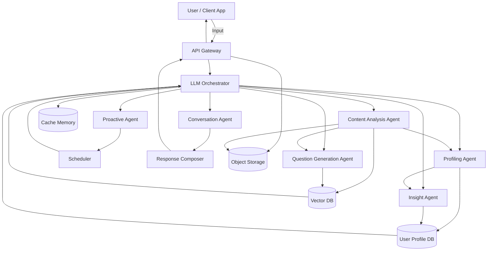

# Project Design

## Architecture Flow

## AI LMS Project Structure

### Core Objectives
- **Dynamic Interaction:** Initiate and adapt interactions dynamically based on user context.
- **Persistent Profiling:** Build and maintain a persistent user profile from interactions.
- **Personalized Insights:** Generate personalized feedback, reports, and learning insights.
- **Content Analysis:** Analyze user-provided content (e.g., documents, text, media) to generate relevant questions and associated topic mappings.
- **Scalable Deployment:** Implement a scalable and modular deployment pipeline and system for real-time user interaction.

### System Components

#### 1. API Gateway
The entry point for all client-side applications. Handles authentication, request routing, and serves as the interface for file uploads (Object Storage) and real-time messaging.

#### 2. LLM Orchestrator
The central intelligence coordinator that:
- Manages state via **Cache Memory (STM)**.
- Routes tasks to specialized agents.
- Aggregates context from the **Vector DB** and **User Profile DB**.

#### 3. Specialized Agents
- **Conversation Agent (CA):** Handles natural language dialogue and interaction flow.
- **Profiling Agent (PA):** Extracts user preferences, knowledge levels, and behaviors to update the **User Profile DB**.
- **Content Analysis Agent (CAA):** Processes uploaded media/documents, performs OCR/parsing, and maps content to topics.
- **Question Generation Agent (QGA):** Creates assessment items based on analyzed content and user level.
- **Insight Agent (IRA):** Analyzes historical data to generate progress reports and learning recommendations.
- **Proactive Agent (PEA):** Triggers scheduled interactions (e.g., reminders, follow-ups) via the **Scheduler**.

#### 4. Data Layer
- **User Profile DB (MEM):** Persistent storage for long-term user data and behavioral patterns.
- **Vector DB (VDB):** Stores embeddings for semantic search and content retrieval.
- **Object Storage (OBJ):** Stores raw user-provided files (PDFs, images, videos).
- **Cache Memory (STM):** High-speed storage for session-specific context.

### Interaction Workflow
1. **Input:** User submits text or content through the API Gateway.
2. **Analysis:** CAA processes files; PA updates the user's context.
3. **Reasoning:** The Orchestrator decides the next step based on the input and current profile.
4. **Generation:** CA or QGA generates a response or assessment.
5. **Output:** Response Composer formats the final output for the user.
