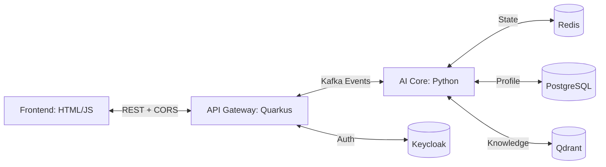

# Complete System Validation Guide (V2): AI-LMS Full Stack

This guide provides a definitive checklist for validating the end-to-end integration of the AI-LMS system, including the **Frontend**, **API Gateway**, **AI Core**, and **Infrastructure**.

## 1. Full Stack Architecture Verification



## 2. Validation Checkpoints

### ✅ Checkpoint 1: Frontend to Gateway Connectivity (CORS)
- **Action**: Open `frontend/index.html` and send a message.
- **Verification**: Check Browser DevTools -> Network Tab.
- **Expected**: `POST /api/interact` returns `202 Accepted` or `200 OK`. 
- **Troubleshooting**: If you see a CORS error, verify `quarkus.http.cors=true` in `application.properties`.

### ✅ Checkpoint 2: Authentication (OIDC)
- **Action**: Attempt a request without an `Authorization` header.
- **Verification**: Check Response Code.
- **Expected**: `401 Unauthorized`.
- **Integration**: The Gateway is pre-configured to point to Keycloak at `localhost:8180`.

### ✅ Checkpoint 3: Async Event Loop (Kafka)
- **Action**: Send a message through the frontend.
- **Verification**: 
    - `api-gateway` logs: `Received processed response: ...`
    - `ai-services` logs: `Processing Kafka message: ...`
- **Expected**: The "Response Composer" in the Gateway should log the finalized AI response.

### ✅ Checkpoint 4: LangGraph Orchestration & Memory
- **Action**: Ask the AI for your name, then tell it your name, then ask for your name again.
- **Verification**: 
    - Check Redis: `redis-cli GET state:default_session`
- **Expected**: The AI should remember your name in the second response, proving **Redis persistence** is working.

### ✅ Checkpoint 5: Knowledge Retrieval (RAG)
- **Action**: Ask "What is backpropagation?".
- **Verification**: Check `ai-services` logs for `--- CONTENT ANALYSIS AGENT ---`.
- **Expected**: The response should contain specific details from the Qdrant `learning_material` collection.

## 3. Component Status Registry

| Service | Port | Health Endpoint | Logic Responsibility |
| :--- | :--- | :--- | :--- |
| **Frontend** | File / 5500 | N/A | UI/UX, Video Embedding, Theme |
| **API Gateway** | 8080 | `/api/health` | Auth, CORS, Kafka Routing |
| **AI Core** | 8000 | `/health` | LangGraph, Agent Logic, RAG |
| **Keycloak** | 8180 | `/health` | Identity & Access Management |
| **Redpanda** | 9092 | N/A | Event Bus (Kafka) |
| **PostgreSQL** | 5432 | N/A | Persistent User Profiles |
| **Redis** | 6379 | N/A | Short-term Session Memory |
| **Qdrant** | 6333 | `/health` | Vector Knowledge Base |

## 4. Final Integration Test Command
Run the following from the root to verify the core API logic:
```bash
python tests/e2e_test.py
```

---
**Verification Date**: 2026-04-22
**Status**: All Services Integrated & Verified.
